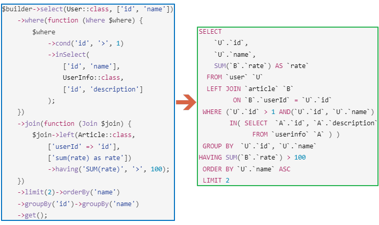

## Построитель SQL запросов на основе мета-информации миграций БД

В век когда ORM шагает по планете обычный построитель запросов выглядит откатом назад. Однако тут есть нюанс - Sql Query Builder использует пакет версионирования [shasoft/db-schema](https://github.com/shasoft/db-schema) и владеет всей информацией о структуре базы данных. Это позволяет реализовать все стандартные для таких решений функции, прозрачно конвертировать типы данных SQL<=>PHP + реализовать нестандартные возможности в виде выборки данных с использованием КЭШирования. (Просьба не искать логику в SQL запросах в статье и [примерах](https://github.com/shasoft/sql-query-builder/docs/examples.md), её там нет. Искусственные примеры предназначены для демонстрации возможностей [пакета](https://github.com/shasoft/sql-query-builder) и никакой другой смысловой нагрузки не несут).



### Стандартные функции

* Работа напрямую с драйвером PDO. Поддерживаются:
  *  [mysql](https://www.php.net/manual/ref.pdo-mysql.php)
  *  [pgsql](https://www.php.net/manual/ref.pdo-pgsql.php)
* Поддержка команд SELECT, INSERT, UPDATE, DELETE
* Соединения JOIN (INNER, LEFT, RIGHT)
* Подзапросы в условиях фильтрации (в том числе многостолбцовые подзапросы)
* Включение условий фильтрации по условию
* Исключение дубликатов, DISTINCT
* Сортировка, оператор ORDER BY
* Группировка, оператор GROUP BY
* Агрегатные функции
* Оператор HAVING
* Ограничение выборки, оператор LIMIT
* Поддержка пагинации (возвращается объект пагинации который содержит всю информацию (текущая страница, общее количество страниц и т.д.))

Кому проще смотреть код, а не читать инструкцию могут посмотреть [стандартные примеры](https://github.com/shasoft/sql-query-builder/docs/examples.md).

### Создание объекта построителя запросов
```php
//-- Миграции
// Получить миграции
$migrations = DbSchemaMigrations::get(
    [
        User::class,
        UserInfo::class,
        Article::class,
        Comment::class,
        TabNoPrimaryKey::class
    ],
    DbSchemaDriverMySql::class
);
// Выполнить дополнительный расчет
BuilderExtraData::run($migrations);
// Выполнить миграции
$migrations->run($pdo);

//-- Создать построитель запросов
$builder =  new Builder(
    $pdo,                          // PDO драйвер
    $migrations->database()        // Информация о БД
    [, new CacheItemPoolInterface] // Необязательный параметр
);
```
Само собой в рабочем проекте миграции не будут выполняться каждый раз при создании построителя запроса. Сами миграции достаточно выполнить отдельно и сохранить готовую схему БД. При создании построителя запросов использовать сохраненную схему.

### Некоторые важные отличия от общепринятого синтаксиса
1. Условия фильтрации указываются **только** через замыкание
```php
$builder
    ->select(Table1::class, ['column1', 'column2',...])
    ->where(function (Where $where) {
        // Тут указываются все условия фильтрации
        // Поддерживается вложенный блок
        $where
            ->cond('id', '>', 1)
            ->inSelect(
                ['column1'],
                Table2::class,
                ['column1', 'column2']
            )->where(function(Where $where) {
                // вложенный блок
                // ..
            });
    });
```
2. Условия соединения указываются **только** через замыкание
```php
$builder
    ->select(Table1::class, ['column1', 'column2',...])
    ->join(function (Join $join) {
        // В данном замыкании указываются все соединения
        // (таких замыканий может быть несколько)
        $join->left(Table2::class, [
            'userId' => 'id'
        ], [
            'column'
        ]);
    });
```
3. Использование отношений для генерации соединений
   Так как имеется информация о структуре БД, то вместо указания таблицы и полей связи можно использовать отношение для создания соединения.
```php
$rows = $builder
    ->select(Comment::class, ['id', 'createAt'])
    ->where(function (Where $where) {
        $where->inArray('id', [1, 3, 5]);
    })
    ->relation('article', ['title'], function (JoinItem $joinItem) {
        $joinItem->relation('author', ['name as authorArticleName']);
    })
    ->relation('author', ['name as authorCommentName'])
    ->get();

```
4. Контекст таблицы
   
   Предположим у нас есть следующая выборка: выбираем комментарий, к нему родительскую статью, к статье имя автора **статьи**.
```sql
SELECT
    `COMMENT_1`.`text`,
    `ARTICLE_1`.`title`,
    `USER_1`.`name`
FROM
    `comment` `COMMENT_1`
LEFT JOIN `article` `ARTICLE_1` ON
    `ARTICLE_1`.`id` = `COMMENT_1`.`articleId`
LEFT JOIN `user` `USER_1` ON
    `USER_1`.`id` = `ARTICLE_1`.`userId`
```
все это реализуется через следующий PHP код
```php
$builder
    ->select(Comment::class, ['text'])
    ->join(function (Join $joinComment) {
        // Переменная $joinComment имеет контекст таблицы = Comment::class
        $joinArticle = $joinComment->left(
            Article::class,
            ['id' => 'articleId'],
            ['title']
        );
        // Переменная $joinArticle имеет контекст таблицы = Article::class
        $joinUser = $joinArticle->left(
            User::class,
            ['id' => 'userId'],
            ['name']
        );
        // Переменная $joinUser имеет контекст таблицы = User::class
    })->get();
```
При создании соединения все связующие поля по умолчанию считаются принадлежащими этому контексту. В примере выше при создании соединения `$joinUser` мы указываем поле `userId` и это означает что это поле контекста `$joinArticle` (т.е. поле таблицы `Article`).
Если мы перепишем в таком вот виде (изменим контекст при создании соединения с `User`):
```php
$builder
    ->select(Comment::class, ['text'])
    ->join(function (Join $joinComment) {
        // Переменная $joinComment имеет контекст таблицы = Comment::class
        $joinArticle = $joinComment->left(
            Article::class,
            ['id' => 'articleId'],
            ['title']
        );
        // Переменная $joinComment имеет контекст таблицы = Comment::class
        $joinUser = $joinComment->left(
            User::class,
            ['id' => 'userId'],
            ['name']
        );
        // Переменная $joinUser имеет контекст таблицы = User::class
    })->get();
```
то получим имя автора **комментария** и вот такой SQL запрос
```sql
SELECT
    `COMMENT_1`.`text`,
    `ARTICLE_1`.`title`,
    `USER_1`.`name`
FROM
    `comment` `COMMENT_1`
LEFT JOIN `article` `ARTICLE_1` ON
    `ARTICLE_1`.`id` = `COMMENT_1`.`articleId`
LEFT JOIN `user` `USER_1` ON
    `USER_1`.`id` = `COMMENT_1`.`userId`
```
Также используя контекст таблицы можно получить имя поля таблицы этого контекста. К примеру SQL запрос выше можно получить через вот такой PHP код:
```php
$builder
    ->select(Comment::class, ['text'])
    ->join(function (Join $joinComment) {
        // Переменная $join имеет контекст таблицы = Comment::class
        $joinArticle = $joinComment->left(
            Article::class,
            ['id' => 'articleId'],
            ['title']
        );
        // Переменная $joinArticle имеет контекст таблицы = Article::class
        $joinUser = $joinArticle->left(
            User::class,
            ['id' => $join->column('userId')], // Указываем поле контекста
            ['name']
        );
        // Переменная $joinUser имеет контекст таблицы = User::class
    })->get();
```
Тут мы создаем соединение через контекст таблицы `Article`, но в условиях связи указываем поле нужного нам контекста, а именно поле `userId` таблицы комментария `Comment`. В результате сгенерируется тот же самый SQL код для выбора автора **комментария**.

Теперь, когда на примере стало понятно, как что такое `контекст таблицы` и как он работает, раскрою вам реальную причину создания такого функционала. Он нужен чтобы выполнять соединения одной таблицы с несколькими. При указании такой связи можно для каждого поля исходной таблицы указать поле другой таблицы в соответствующем ему контексте.
К примеру вот такой код:
```php
$builder
    ->select(Comment::class, ['text'])
    ->join(function (Join $joinComment) {
        // Переменная $join имеет контекст таблицы = Comment::class
        $joinArticle = $joinComment->left(
            Article::class,
            ['id' => 'articleId'],
            ['title']
        );
        // Переменная $joinArticle имеет контекст таблицы = Article::class
        $joinComment->left(
            User::class,
            [
                'id' => $joinComment->column('userId'),
                'age' => $joinArticle->column('id')
            ],
            ['name']
        );
    })->get();
```
сгенерирует вот такой  SQL код
```sql
SELECT
    `COMMENT_1`.`text`,
    `ARTICLE_1`.`title`,
    `USER_1`.`name`
FROM
    `comment` `COMMENT_1`
LEFT JOIN `article` `ARTICLE_1` ON
    `ARTICLE_1`.`id` = `COMMENT_1`.`articleId`
LEFT JOIN `user` `USER_1` ON
    `USER_1`.`id` = `COMMENT_1`.`userId` AND `USER_1`.`age` = `ARTICLE_1`.`id`
```

Чтобы минимизировать передачу переменной контекста в нужное замыкание можно использовать `именованный контекст таблицы`. Для этого можно вызвать метод `name()` соответствующего контекста и указать его имя. В дальнейшем при использовании метода `column()` контекста вторым параметром указываем нужное имя. Пример:
```php
$builder->select(User::class, ['name'])
    ->name('main') // Устанавливаем имя контекста
    ->where(function (Where $where) {
        $where->inSelect(
            'id',
            Article::class,
            'userId',
            function (Select $select) {
                $select
                    ->where(function (Where $where) {
                        $where->cond(
                            'id',
                            '=',
                            // Используемый именованный контекст
                            $where->column('id', 'main')
                        );
                    });
            }
        );
    })
    ->get();
```
сгенерированный SQL код. 
```sql
SELECT
    `USER_1`.`name`
FROM
    `user` `USER_1`
WHERE
    `USER_1`.`id` IN(
    SELECT
        `ARTICLE_1`.`userId`
    FROM
        `article` `ARTICLE_1`
    WHERE
        `ARTICLE_1`.`id` = `USER_1`.`id`
)
```
Мы установили имя для контекста таблицы `User` и затем использовали его в условии фильтрации. И да, `контекст таблицы` можно использовать не только в соединениях, но и в условиях фильтрации.

Обратите внимание, имя контекста - это не псевдоним таблицы в SQL запросе. Псевдонимы таблиц генерируются автоматически и установить их вручную невозможно. Да и необходимости такой нет.

### НеСтандартная функция заполнения

Кому проще смотреть код, а не читать инструкцию могут сразу посмотреть [примеры заполнения](https://github.com/shasoft/sql-query-builder/docs/examples-fill.md).

К примеру у нас стоит задача: выбрать по идентификаторам список комментариев. К каждому из них выбрать автора комментария, родительскую статью и автора статьи. 

Для использования КЭШирования необходимо выполнить следующие шаги:
1. Выбрать список уникальных идентификаторов статей
3. Выбрать список комментариев по которым нет информации в КЭШе
4. Сохранить в КЭШ все отсутствующие там данные по выбранным комментариям
5. Выбрать список уникальных идентификаторов родительских статей
6. Выбрать список статей по которым нет информации в КЭШе
7. Сохранить в КЭШ все отсутствующие там данные по выбранным статьям
8. Выбрать список уникальных идентификаторов пользователей авторов комментариев и статей
9. Выбрать список пользователей по которым нет информации в КЭШе
10. Сохранить в КЭШ все отсутствующие там данные по выбранным пользователям
11. Записать все выбранные данные в исходные строки

Все эти шаги можно выполнить с использованием функции `fill()`, которая прячем `под капотом` все приведенные выше пункты:
```php
// Список строк с идентификаторами комментариев
$rows = [
    ['id' => 1],
    ['id' => 3],
    ['id' => 5],
    ['id' => 3],
];
$fill = $builder
    // Вызываем функцию и указываем строки для заполнения
    ->fill($rows)
    // Выбрать данные из таблицы с комментариями
    ->fromTable(Comment::class, ['id'], ['text'], function (From $fromComment) {
        // Выбрать автора комментария
        $fromComment->joinTable(
            User::class,
            ['id' => 'userId'],
            ['name as authorCommentName']
        );
        // Выбрать родительскую статью
        $fromUserArticle = $fromComment->joinTable(
            Article::class,
            ['id' => 'articleId'],
            ['title']
        );
        // Выбрать автора статьи
        $fromUserArticle->joinTable(
            User::class,
            ['id' => 'userId'],
            ['name as authorArticleName']
        );
    });
```
в результате будет сгенерирован следующий код для трех SQL запросов
```sql
SELECT
    *
FROM
    `comment`
WHERE
    `id` IN(1, 3, 5)
SELECT
    *
FROM
    `article`
WHERE
    `id` IN(8, 10)
SELECT
    *
FROM
    `user`
WHERE
    `id` IN(10, 3, 9, 6, 7)
```
В каждую исходную строку будут записаны поля: `text`, `authorCommentName`, `title`, `authorArticleName` с соответствующими значениями. Все результаты выборок будут сохранены в КЭШ. При внесении изменений в соответствующие строки БД через команды `UPDATE` и `DELETE` соответствующие значения в КЭШе будут удаляться.

При этом данная функция будет работать и при отключенном КЭШе. В этом случае будет генерироваться следующий SQL код:
```sql
SELECT
    `COMMENT_1`.`text`,
    `COMMENT_1`.`id` AS `~~~id`,
    `ARTICLE_1`.`title`,
    `USER_1`.`name` AS `authorCommentName`,
    `USER_2`.`name` AS `authorArticleName`
FROM
    `comment` `COMMENT_1`
LEFT JOIN `article` `ARTICLE_1` ON
    `ARTICLE_1`.`id` = `COMMENT_1`.`articleId`
LEFT JOIN `user` `USER_1` ON
    `USER_1`.`id` = `COMMENT_1`.`userId`
LEFT JOIN `user` `USER_2` ON
    `USER_2`.`id` = `ARTICLE_1`.`userId`
WHERE
    `COMMENT_1`.`id` IN(1, 3, 5)
```
и в результате работы функции `fill()` заполняемые строки с данными будут содержать те же самые данные что и при включенном КЭШе. Это позволяет писать один и тот же код в независимости от того используется КЭШ или нет.

### Некоторые нереализованные штуки

1. Нет поддержки соединения вида FULL так как в MySql этот вид соединения не поддерживается. Убрал для совместимости.
2. Не поддерживаются соединения в DELETE так как PostgreSQL не поддерживает такого. Убрал для совместимости.
3. Не поддерживаются соединения в UPDATE так как PostgreSQL не поддерживает такого. Убрал для совместимости.
4. Функция `fill()` на текущий момент не поддерживает многоколоночные первичные ключи. Отложил реализацию на будущее.